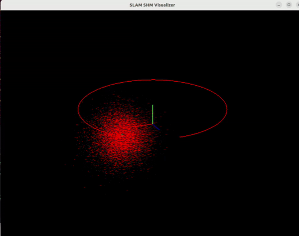

# High-Performance SLAM Visualizer: Python-to-C++ Shared Memory Bridge

---

This project provides a robust, low-latency visualization pipeline designed for robotics and SLAM research (UAVs, AUVs, and Warehouse Automation). It allows a Python "Producer" (your SLAM node) to stream massive 3D datasets to a standalone C++ "Consumer" (Pangolin Visualizer) using **Shared Memory (SHM)**.

## 🚀 Key Features

- **Zero-Copy Communication:** Bypasses the network stack using `/dev/shm` for near-instantaneous data transfer.
- **Multi-Modal Support:** Handles 3D Point Clouds (with RGB colors), Trajectory Line Strips, and 4x4 Homogeneous Transformation Matrices (Keyframe Poses).
- **Hardware Accelerated:** Uses OpenGL Vertex Buffer Objects (VBOs) with interleaved memory patterns to maximize GPU throughput.
- **Persistent Visualizer:** The C++ window can stay open even if the Python script is restarted, thanks to Inode-persistent memory mapping.
- **Bug-Free Handshake:** Resolves common "Message too long" (UDP MTU) and "Stale Data" issues.

---

## 📂 Project Structure

Plaintext

```
.
├── CMakeLists.txt        # Build configuration for C++
├── viz_util.cpp          # C++ Standalone Visualizer (Consumer)
├── shm_sender.py         # Python SHM Utility & Simulator (Producer)
├── build/                # Compiled binaries
└── README.md             # You are here`
```
---

## 🛠️ Requirements & Environment

- **OS:** Ubuntu 22.04+ (Linux required for POSIX Shared Memory)
- **C++:** GCC 11+ (C++17)
- **Dependencies:**
    - **Pangolin:** 3D Visualization engine.
    - **Eigen3:** Linear algebra and matrix mapping.
    - **NumPy:** For high-speed array manipulation in Python.

---

## ⚡ Technical Deep-Dive

### 1. The Shared Memory Protocol

We use a strict binary offset protocol to ensure Python and C++ stay synchronized:

| **Offset (Bytes)** | **Content** | **Type** | **Description** |
| --- | --- | --- | --- |
| **0 - 3** | `num_pcd` | `int32` | Count of XYZRGB points |
| **4 - 7** | `num_traj` | `int32` | Count of Trajectory vertices |
| **8 - 11** | `num_kf` | `int32` | Count of 4x4 Pose matrices |
| **100+** | **PCD Data** | `float32` | Interleaved `[x,y,z,r,g,b]` |
| **Follows PCD** | **Trajectory** | `float32` | `[x,y,z]` list |
| **Follows Traj** | **Keyframes** | `float32` | Column-Major `4x4` matrices |

### 2. GPU Optimization (VBO Stride)

The C++ side utilizes an **Interleaved Vertex Pattern**. Instead of making multiple calls to the GPU, we send position and color in one pass.

$$\text{Stride} = 6 \times \text{sizeof(float)} = 24 \text{ bytes}$$

This tells the GPU to read 3 floats for position, skip the next 3 (color) to find the next position, and vice-versa, ensuring 100% spatial locality in VRAM.

---

## 💻 Installation & Usage

### 1. Build the C++ Visualizer

Bash
```
`mkdir build && cd build
cmake ..
make -j$(nproc)`
```
### 2. Run the System

**Important:** Start the Python script first to initialize the shared memory segment.

**Terminal 1 (Python):**

Bash
```
`python3 shm_sender.py`
```
**Terminal 2 (C++):**

Bash
```
`./build/viz_util`
```
---
## Demo

---
## ⚠️ Troubleshooting

- **Permission Denied:** Ensure you have write access to `/dev/shm`.
- **Coordinates Scrambled:** Verify that your Python matrices use `order='F'` (Fortran/Column-Major) to match Eigen's memory layout.
- **Memory Overflow:** If sending $> 500k$ points, increase `size_mb` in the `SHMSender` constructor.
- **Resetting the Bridge:** If the memory becomes corrupted due to a hard crash, clear it manually:Bash
    
    ```rm /dev/shm/slam_buffer```
    

---

## 🤝 Contribution

This utility was built to support advanced robotics projects like Project ORCA and Project Bee. If you add features like **Loop Closure** visualization or **Semantic Labeling** (more color channels), please feel free to open a Pull Request!

---
